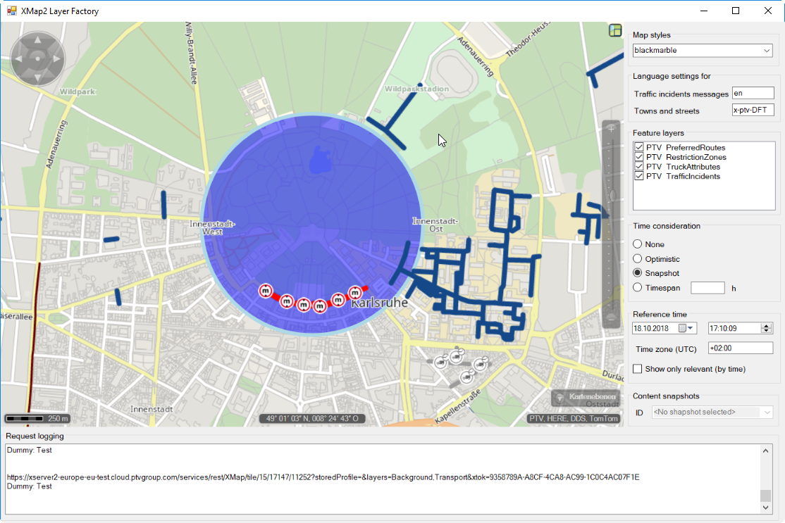
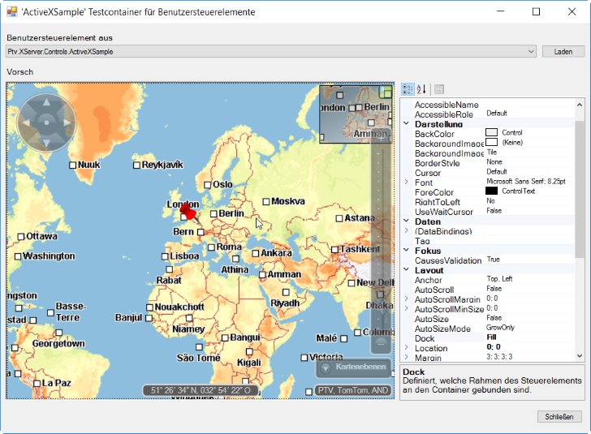
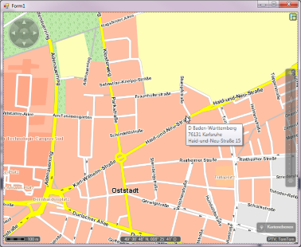

xservernet-bin
==============

A bin of samples and demos for [PTV xServer .NET](https://xserverinternet.azurewebsites.net/xserver.net/).

### Resources

* [xserver.net](https://github.com/ptv-logistics/xserver.net) - Source code for PTV xServer.NET
* [xserver.net-docs](https://ptv-logistics.github.io/xserver.net-docs) - API documentation for xServer.NET

### The samples

#### [Xmap2LayerFactoryTest](Xmap2LayerFactoryTest) Demonstrates the API for native Xmap2/FeatureLayer support.

#### [SharpMap.Widgets](https://github.com/ptv-logistics/SharpMap.Widgets) - Build responsive map applications for web and desktop

#### [ActiveX](ActiveX) Shows how to use the map as ActiveX control

#### [BasemapTooltips](BasemapTooltips) Shows how to display city/street information as tool tip by reverse locating

#### Circles
Shows how to render circles with a geographic radius

#### CustomBgProfiles
Shows how to switch the basemap profile 

#### CustomInit
Shows how to explicitly initialize the xMapServer base map

#### CustomLayout
Shows how to set-up a map-layout with custom gadgets

#### CustomLocalizer
Shows how to user your own string resources to localize the texts of the control.

#### CustomPanAndZoom
Shows how to change the default behavior for pan/zoom interaction.

#### Donuts
Shows how to build a datasource and renderer for in-memory computed shapes.

#### DrawMode
The basic code to add an interactor for drawing custom polygons

#### DragAndDrop
Shows how to implement drag&drop for elements on the map.

#### ExtensibilityTest
Tests for customization and extensions of the map control

#### FeatureLayers
Shows how to render Feature Layers on the control

#### FormsMapCS
Shows how to add the map to a Windows Forms application in C#

#### FormsMapVB
Shows how to add the map to a Windows Forms application in VB.NET

#### HereImagery
Shows how to add here basemap tiles

#### Mandelbrot
Shows how to implement a client-side tile provider and demonstrates the "Infinite Zoom" feature

#### ManySymbols
Shows practices to display many symbols with the ShapeLayer

#### ManySymbols2
Shows how to display even more symbols by implementing a custom layer

#### MapArrowDemo
Shows how to build custom shapes for the shape layer

#### MFCMapDialog
Shows how to add the map to an MFC applciation

#### MultipleContainers
Test for map controls in mutliple tab-, split, and dock-containers

#### MemAssertDemo
A utility class + demo that helps to track-down memory-leaks in your code.

#### MemoryPressureTest
Tips to optimize xServer.NET for limited-memory scenarios

#### PieChartsAndExport
Shows how to render arbitrary wpf elements and print/export the map content

#### RoutingVB
Shows how to add drag&drop routing to a Visual Basic project.

#### SelectionDemo
Shows how to render custom icons and select them by dragging a rubber band

#### ServerSideRendering
Shows how to render additional xMap layers with tooltip interaction

#### SimpleWms
Shows how to add simple WMS (with "Google" EPSG:3857) layers to the control

#### SymbolsAndLabels
Shows how to draw symbols with an attached label tag

#### TourPlanningDemo
Shows practices how to use the new xTour 1.18 job api @xServer internet

#### ToursAndStopsMultiCanvas
Shows how to build one logical layer containing differrent canvases rendered before and after the xMap labels

#### VdiPerformance
Benchmark for different settings that influcence performance on Virtual Desktop Environmnets (VDI)

#### XYNSegments
Shows how to select and render xServer XYN-Segments

