xserver.net-samples
===================

A bin of samples and demos for [PTV xServer .NET](https://xserverinternet.azurewebsites.net/xserver.net/).

### Resources

* [xserver.net](https://github.com/ptv-logistics/xserver.net) - Source code for PTV xServer.NET
* [xserver.net-docs](https://ptv-logistics.github.io/xserver.net-docs) - API documentation for xServer.NET

### Remarks
For xServer internet an additional authentication is needed compared to an on-premise solution. This authentication consists of a common user/password pair which has to be set at the corresponding property of the Map control. A special user <em>xtok</em> exists which can be used for unregistered clients. The corresponding password, called xToken, can be [obtained](https://www.ptvgroup.com/en/solutions/products/ptv-xserver/test-now) to grant full access of xServer functionality.

Due to this full acces the xToken cannot be provided in the source code. Instead, place holders are used. They are replaced when the build process is started by a tool called <em>Insert-XS.Net-Token.exe</em>. When this tool finds an appropriate place holder, it shows a dialog to insert the xToken.

To access multiple sample projects without any tedious repetition of xToken insertion, <em>Insert-XS.Net-Token.exe</em> can be used to substitute the place holders in <strong>all</strong> projects. This tool is located in <em>libs</em> subfolder of the base directory. Via commandline add the following parameters:

Insert-XS.Net-Token.exe -path "base directory of xserver.net-samples project"

### The samples

#### [Xmap2LayerFactoryTest](Xmap2LayerFactoryTest) \#new \#xserver-2
Demonstrates the API for native Xmap2/FeatureLayer support.

#### [WMTSLayer](WMTSLayer) \#new \#wms \#xserver-2 \#3rd-party
Demonstrates the integration and initialization of a layer showing Web Map Tile Service (WMTS) content.

#### [DemoCenter](DemoCenter) \#new \#xserver-1
Source code for xServer.NET demo center.

#### [SharpMap.Widgets](https://github.com/ptv-logistics/SharpMap.Widgets) \#new #interop \#sharpmap \#shapefile \#javascript
Build responsive map applications for web and desktop

#### [ActiveX](ActiveX) \#interop
Shows how to use the map as ActiveX control

#### [BasemapTooltips](BasemapTooltips) \#xserver-1
Shows how to display city/street information as tool tip by reverse locating

#### [Circles](Circles) \#custom-data
Shows how to render circles with a geographic radius

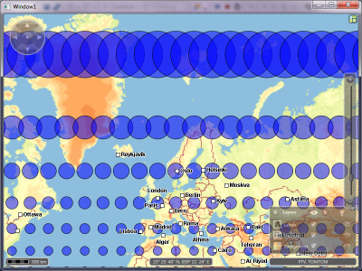

#### [CustomBgProfiles](CustomBgProfiles) \#xserver-1
Shows how to switch the basemap profile 

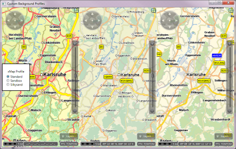

#### [CustomInit](CustomInit) \#customize
Shows how to explicitly initialize the xMapServer base map

#### [CustomLayout](CustomLayout) \#customize
Shows how to set-up a map-layout with custom gadgets

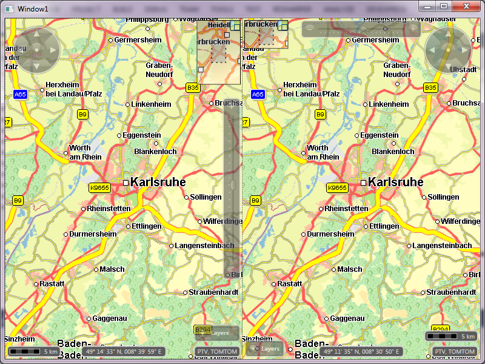

#### [CustomLocalizer](CustomLocalizer) \#customize
Shows how to use your own string resources to localize the texts of the control.

#### [CustomPanAndZoom](CustomPanAndZoom) \#customize
Shows how to change the default behavior for pan/zoom interaction.

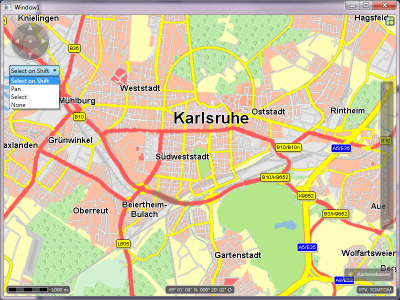

#### [Donuts](Donuts) \#customize
Shows how to build a datasource and renderer for in-memory computed shapes.

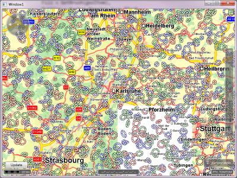

#### [DrawMode](DrawMode) \#customize
The basic code to add an interactor for drawing custom polygons

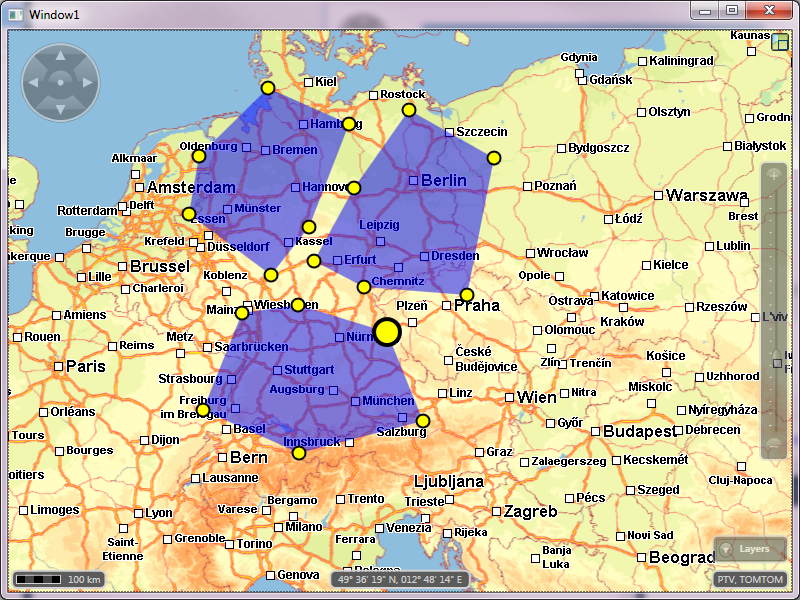

#### [DragAndDrop](DragAndDrop) \#customize
Shows how to implement drag&drop for elements on the map.

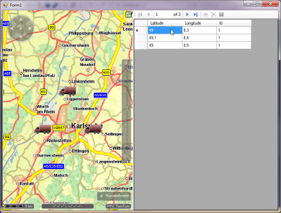

#### [ExtensibilityTest](ExtensibilityTest) \#customize
Tests for customization and extensions of the map control 

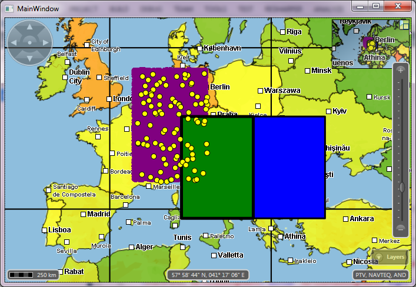

#### [FeatureLayers](FeatureLayers) \#xserver-1
Shows how to render Feature Layers on the control

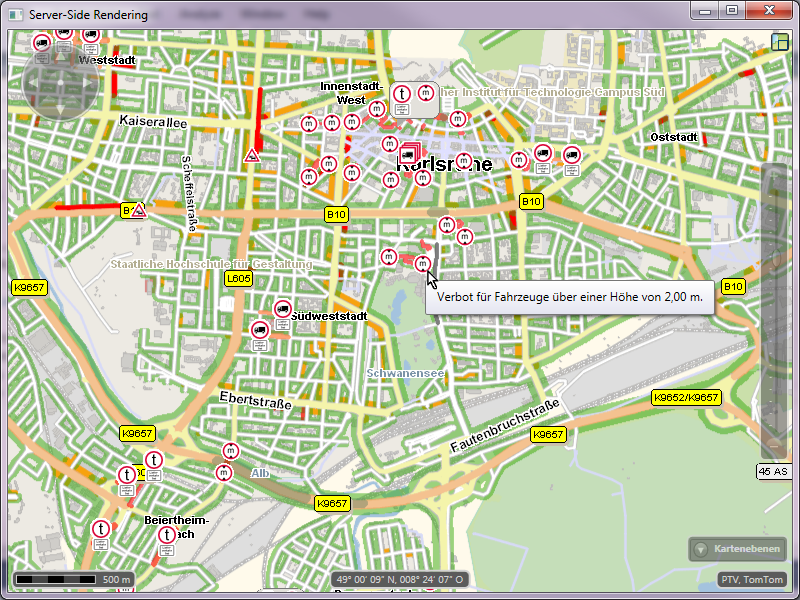

#### [FormsMapCS](FormsMapCS) \#hello-world
Shows how to add the map to a Windows Forms application in C#

#### [FormsMapVB](FormsMapVB) \#hello-world
Shows how to add the map to a Windows Forms application in VB.NET

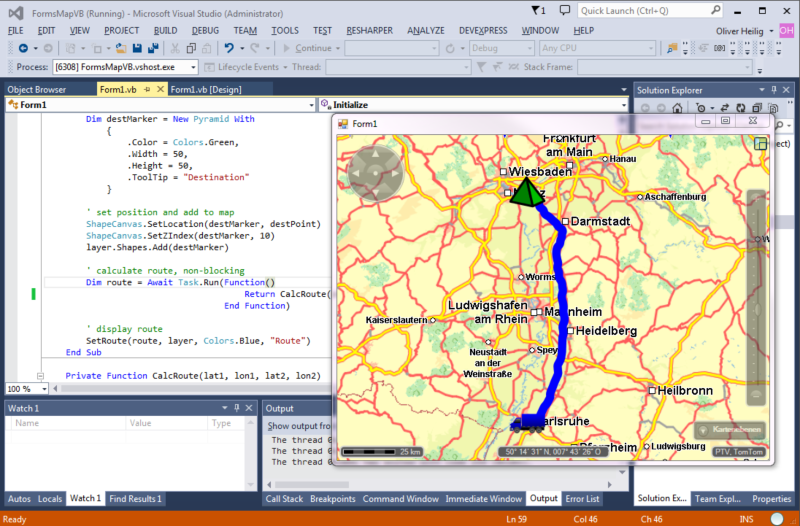

#### [HereImagery](HereImagery) \#interop \#3rd-party
Shows how to add here basemap tiles

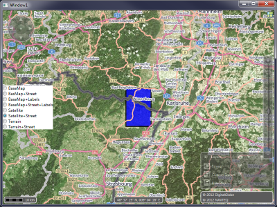

#### [Mandelbrot](Mandelbrot) \#customize
Shows how to implement a client-side tile provider and demonstrates the "Infinite Zoom" feature

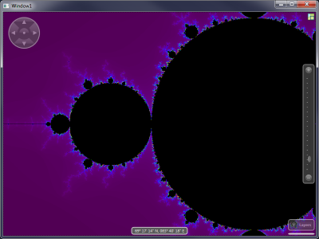

#### [ManySymbols](ManySymbols) \#customize
Shows practices to display many symbols with the ShapeLayer

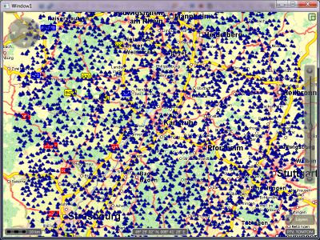

#### [ManySymbols2](ManySymbols2) \#customize
Shows how to display even more symbols by implementing a custom layer

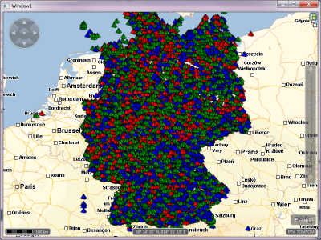

#### [MapArrowDemo](MapArrowDemo) \#customize
Shows how to build custom shapes for the shape layer

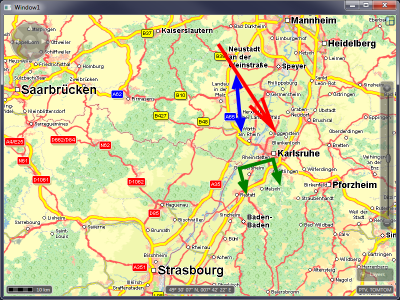

#### [MFCMapDialog](MFCMapDialog) #\interop
Shows how to add the map to an MFC applciation

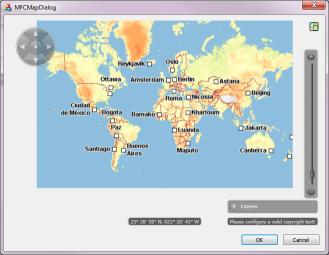

#### [MultipleContainers](MultipleContainers) \#customize
Test for map controls in mutliple tab-, split, and dock-containers

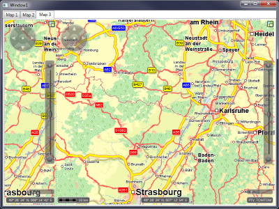

#### [MemAssertDemo](MemAssertDemo) \#testing
A utility class + demo that helps to track-down memory-leaks in your code.

#### [MemoryPressureTest](MemoryPressureTest) \#testing
Tips to optimize xServer.NET for limited-memory scenarios

#### [PieChartsAndExport](PieChartsAndExport) \#user-data
Shows how to render arbitrary wpf elements and print/export the map content

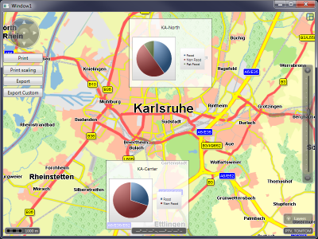

#### [RoutingVB](RoutingVB) \#interop
Shows how to add drag&drop routing to a Visual Basic project.

#### [SelectionDemo](SelectionDemo) \#customize
Shows how to render custom icons and select them by dragging a rubber band

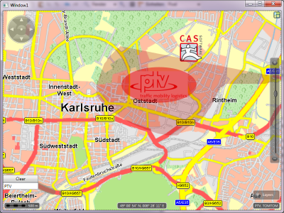

#### [ServerSideRendering](ServerSideRendering) \#xserver-1
Shows how to render additional xMap layers with tooltip interaction

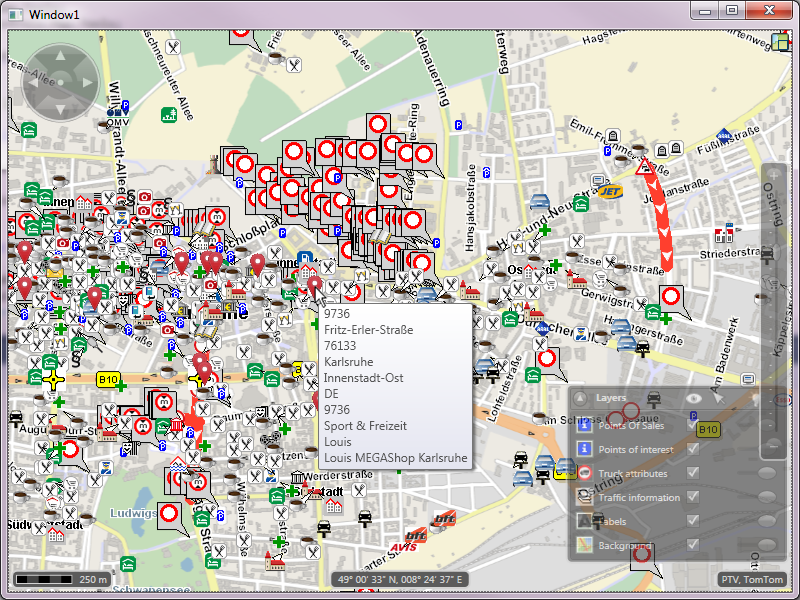

#### [SimpleWms](SimpleWms) \#3rd-party
Shows how to add simple WMS (with "Google" EPSG:3857) layers to the control

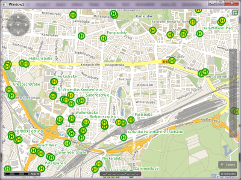

#### [SymbolsAndLabels](SymbolsAndLabels) \#customize
Shows how to draw symbols with an attached label tag

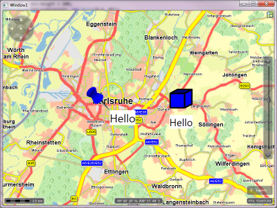

#### [TourPlanningDemo](TourPlanningDemo) \#xserver-1
Shows practices how to use the new xTour 1.18 job api @xServer internet

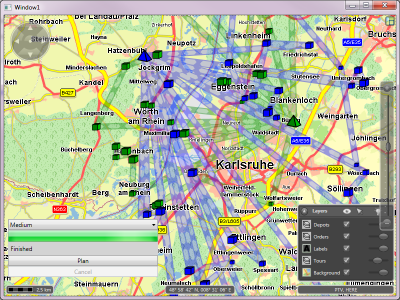

#### [ToursAndStopsMultiCanvas](ToursAndStopsMultiCanvas) \#customize
Shows how to build one logical layer containing differrent canvases rendered before and after the xMap labels

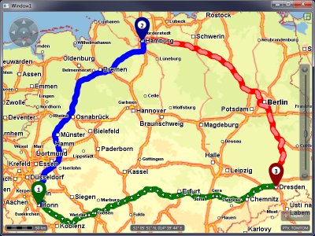

#### [VdiPerformance](VdiPerformance) \#testing
Benchmark for different settings that influcence performance on Virtual Desktop Environmnets (VDI)VdiPerformance

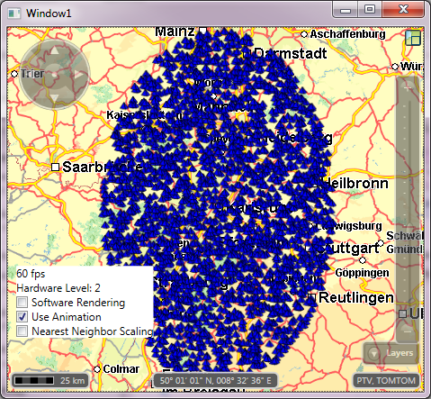

#### [XYNSegments](XYNSegments) \#xserver-1
Shows how to select and render xServer XYN-Segments

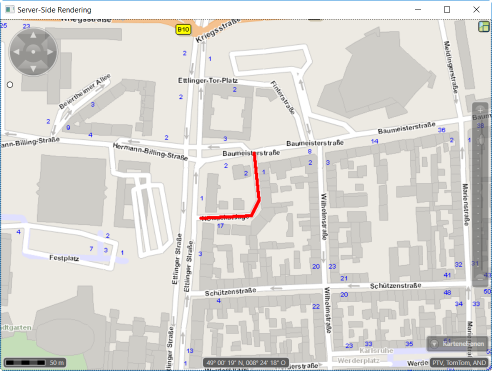
